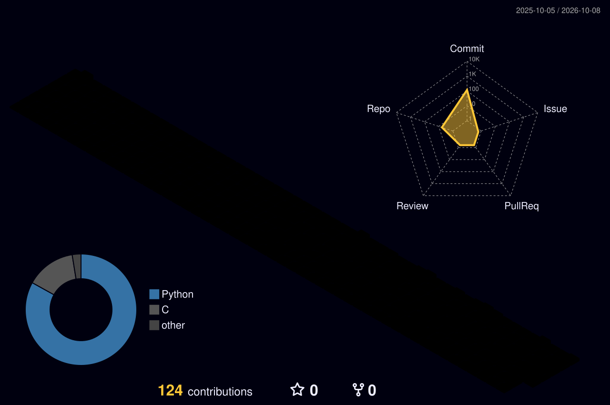

<h1 align="center"><strong>Daniel Fernandes</strong></h1>
<p align="center">Software Engineer Student @ Codam (42 Network)</p>


<p align="center">
  <a href="https://www.linkedin.com/in/daniel-fm-fernandes/">LinkedIn</a> ·
  <a href="https://www.instagram.com/danielfernandesdesigns">Instagram</a>
</p>

<p align="center">
  Background in design, now building software and robotics.<br>
  I work mainly in <strong>C and Python</strong>.
</p>

<p align="center">
  <a href="https://github.com/oakoudad/badge42">
    
  </a>
</p>

---

<h3 align="center">Tools & Technologies</h3>

<p align="center"><strong>Design Tools:</strong></p>
<p align="center">
  
</p>

<p align="center"><strong>Programming Languages:</strong></p>
<p align="center">
  
</p>

---

```python
from dataclasses import dataclass

@dataclass
class AboutMe:
    user: str
    role: str
    hobbies: list[str]
    city: str

daniel = AboutMe(
    user="Daniel Fernandes",
    role="Designer & Coder",
    hobbies=["Muay Thai", "Drawing", "Reading", "Video Games"],
    city="Amsterdam, The Netherlands",
)
```

---

> _“I never turn down requests for interviews. I'm just rarely asked.”_

---

### Profile Overview  

