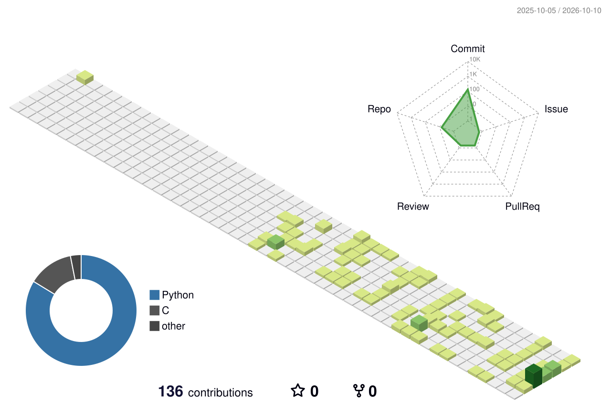

<h1 align="center"><strong>Daniel Fernandes</strong></h1>
<p align="center">Software Engineer Student at Codam (42 Network)</p>


<p align="center">
  <a href="https://www.linkedin.com/in/daniel-fm-fernandes/">LinkedIn</a> ·
  <a href="https://www.instagram.com/danielfernandesdesigns">Instagram</a>
</p>


Background in design, now building software at **Codam**.
I work mainly in **C and Python**.

---

### Tools & Technologies  

**Design Tools:**  


**Programming Languages:**


---

```c
typedef struct s_about_me
{
    char    *user;
    char    *role;
    char    *hobbies[4];
    char    *city;
}   t_about_me;

t_about_me  daniel = {
    .user    = "Daniel Fernandes",
    .role    = "Designer & Coder",
    .hobbies = {"Muay Thai", "Drawing", "Reading", "Video Games"},
    .city    = "Amsterdam, The Netherlands"
};
```

---

> _“I never turn down requests for interviews. I'm just rarely asked.”_

---

### Profile Overview  

